# Facial Keypoint Detection
---

The objective was to detect the landmarks/keypoints on the face of an individual using CNN.
And different transformations where used to make the model robust to detect the landmarks even when the subject is ocluded or looking away.

|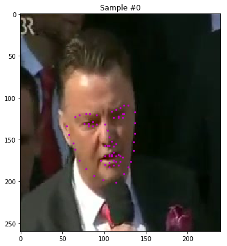|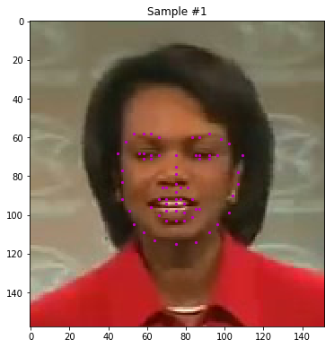|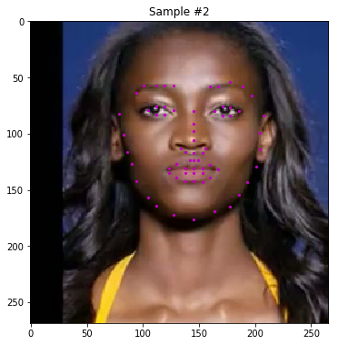|
|:---:|:---:|:---:|
||_Sample Images with Overlayed Keypoints_||

In addition to the transforms required by the rubric such as  RandomCrop, RandomRotate and Normalize, _Random Shear_ and _RandomScale_ was also added to help the model generalize. All the transformation listed above where custom written (instead of using the pre-defined transformation by PyTorch). [Refer to data_load.py](./data_load.py).

|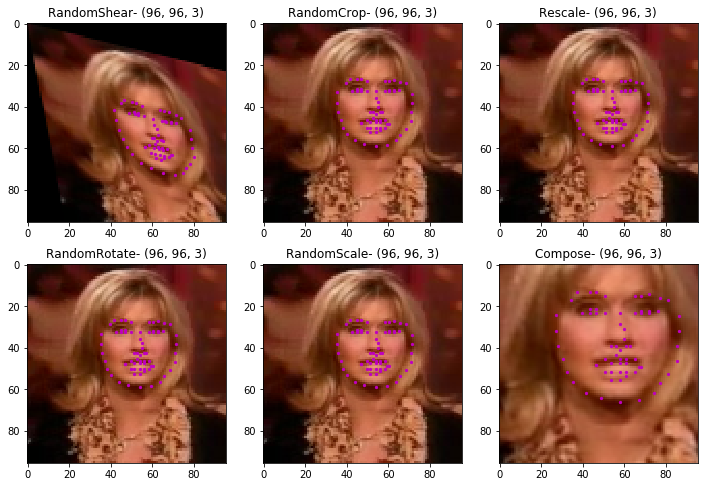|
|:---:|
|_Additional custom transforms - `RandomShear`, `RandomCrop`, `RandomScale`_|

Further more, multiple variation of the model architecture was tried out (along with different model architectures) and finalized using `NaimishNet`, a network based on LeNet's architecture. (Reference: [NaimishNet](https://arxiv.org/pdf/1710.00977.pdf)), intialized using _He Initialization_ and trained for $50$ epochs with a batch size of $32$. (Refer to [models.py](./models.py) for the network architectures).

|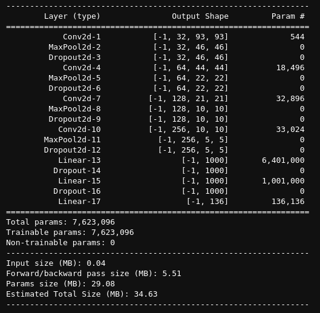|
|:---:|
|_NaimishNet Architecture_|

The plots below illustrates the different experiments conducted to help finalize the parameters and the architecture

|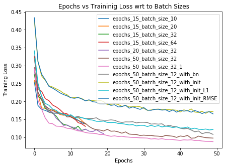|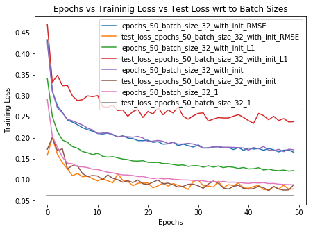|
|:---:|:---:|
|_Experiments with different Batch Size, Initialization etc_|_Training and Validation Loss against each experiment_|

The results/predictions on the test images are shown below

|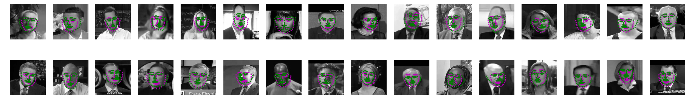|
|:---:|
|_Facial Landmark Predictions_|

|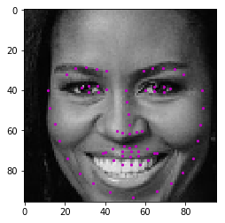|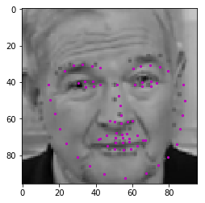|
|:---:|:---:|
|_Facial Landmark Predictions_|_Facial Landmark Predictions_|

To demonstrate the use of facial keypoint detection, the trainined model was used accessories to Christopher_Walken as shown below. The keypoint location guide is used to get the required keypoints (i.e. the one around the eye) to place the glasses.

||
|:---:|
|_Facial Landmark Positions_|

|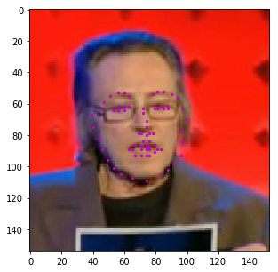|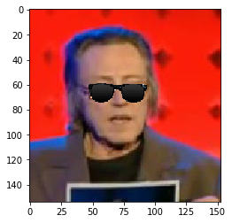|
|:---:|:---:|
|_Original Image_|_Adding glasses using the predicted keypoints_|

---
The project was part of Udacity Computer Vision Nanodegree and the reviewers comments can be found [here](./facial_keypoint_detection_review.pdf).